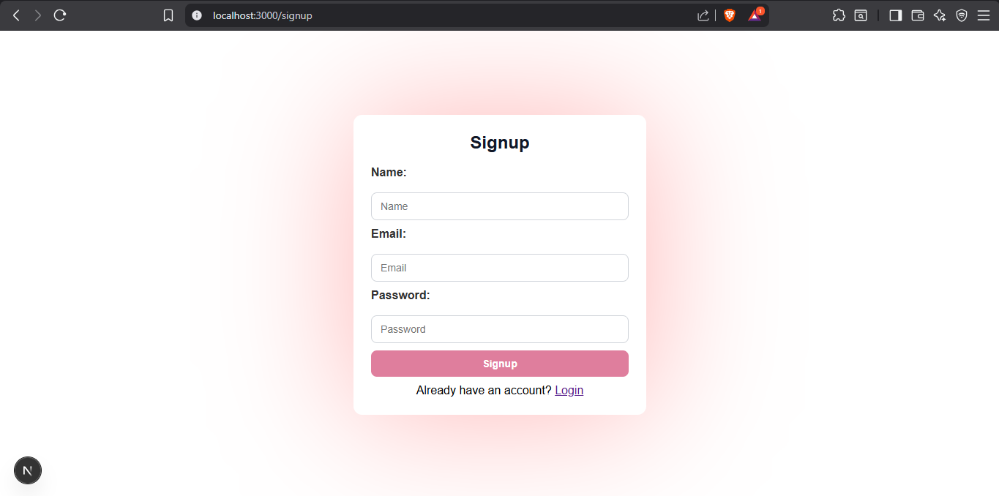

# Day 5 - Next.js App

A simple Next.js application with user authentication and post management features.

## Features

- User authentication (login/signup)
- User dashboard
- Post creation and management
- User profile management
- JWT-based authentication
- State management with Zustand

## Screenshots

### Login Page


### Signup Page


### Dashboard


### User Profile


### Add Post


### Edit Post


## Tech Stack

- **Framework**: Next.js 15.5.5 with App Router
- **Frontend**: React 19.1.0
- **Authentication**: JWT with bcrypt
- **State Management**: Zustand
- **Database**: Supabase
- **Styling**: CSS

## Getting Started

1. Clone the repository
2. Install dependencies:
   ```bash
   npm install
   ```

3. Set up environment variables:
   Create a `.env` file in the root directory with your configuration.

4. Run the development server:
   ```bash
   npm run dev
   ```

5. Open [http://localhost:3000](http://localhost:3000) in your browser

## Available Scripts

- `npm run dev` - Start development server with Turbopack
- `npm run build` - Build the application for production
- `npm start` - Start the production server
- `npm run lint` - Run ESLint

## Project Structure

```
src/
├── app/
│   ├── api/auth/        # Authentication API routes
│   ├── dashboard/       # Dashboard page
│   ├── profile/         # User profile page
│   ├── signup/          # User registration page
│   ├── addPost/         # Post creation page
│   ├── updatePost/      # Post editing page
│   └── lib/             # Utility functions
├── header/              # Header component
└── globals.css          # Global styles
```

## Authentication

The app uses JWT tokens for authentication with the following endpoints:
- `/api/auth/login` - User login
- `/api/auth/signup` - User registration

User data is stored in `users.json` for development purposes.
